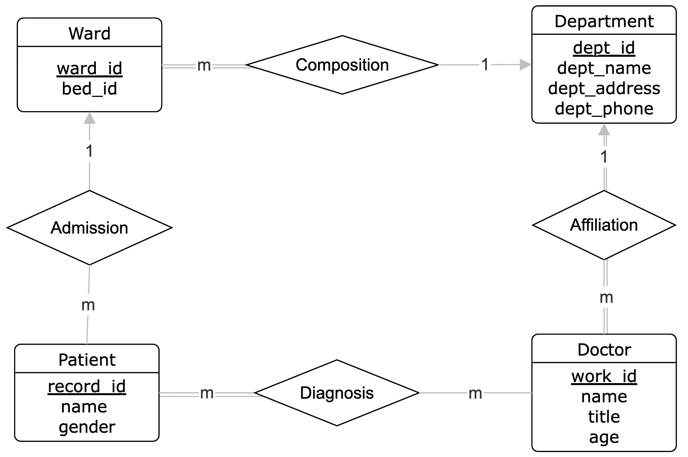

# Assignment 3
This repository contains both the theory and programming components for the assignment.

## Deadline: 16th November, midnight (CST).

## Theory Assigment
- Write your name, UIC email in ID, and the answers in [theory/TheoryAssignment_3.docx](theory/TheoryAssignment_3.docx)
- Create a PDF file from the completed theory assignment.
- The theory component has 2 questions. 
- 5 points each for graduate students and 15 points each for undergraduates.

## Programming Assignment
- [programming](programming) folder contains two SQL files.

### Application 1: Hospital Management System
#### DDL Part (Task 1.1):
Based on the provided ER diagram of the **Hospital Management System** application, write the SQL Data Definition Language (DDL) statements to create the database schema. 
The SQL script should:
- Create tables: Define tables for all the entities and relationships shown in the diagram. The tables are: Department, Ward, Patient, Doctor, Diagnosis. 
- Specify primary keys: Assign primary keys to each table as shown.
- Set foreign keys: Define foreign key constraints to maintain referential integrity between tables.
- Include data types: Use appropriate data types for each attribute (e.g., INT, VARCHAR, DATE).
- Add constraints: Ensure attributes like NOT NULL, UNIQUE, and other necessary constraints are included.




#### DML Part (Task 1.2, 1.3, 1.4):
Using the SQL schema from Task 1.1, follow these steps to perform data operations. After completing each task, display the content of all the tables to show the updated data. 

For example, when you complete Task 1.2. Insert Data do:
```sql
SELECT * FROM Department;
SELECT * FROM Ward;
SELECT * FROM Patient;
SELECT * FROM Doctor;
SELECT * FROM Diagnosis;
```

Do the same after completing task 1.3 and task 1.4.

##### Task 1.2. Insert Data
```shell
Department:
dept_id = 1, dept_name = 'Cardiology', dept_address = '1st Floor, Building A', and dept_phone = '555-1234'.
dept_id = 2, dept_name = 'Neurology', dept_address = '1st Floor, Building B', and dept_phone = '555-9876'.

Ward:
ward_id = 1, bed_id = 101, dept_id = 1.
ward_id = 2, bed_id = 102, dept_id = 1.
ward_id = 3, bed_id = 201, dept_id = 2.

Patient:
record_id = 1, name = 'Alice Smith', gender = 'F', ward_id = 1.
record_id = 2, name = 'Bob Jones', gender = 'M', ward_id = NULL.
record_id = 3, name = 'Charlie Brown', gender = 'M', ward_id = 3.

Doctor:
work_id = 1, name = ‘Dr. Smith’, title = ‘'Cardiologist', age = 45, dept_id = 1.
work_id = 2, name = ‘Dr. Emily White’, title = ‘'Cardiologist', age = 38, dept_id = 1.
work_id = 3, name = ‘Dr. John Doe’, title = ‘'Neurologist', age = 42, dept_id = 2.

Diagnosis:
record_id = 1, work_id = 1
record_id = 2, work_id = 2
```

##### Task 1.3. Update Data

- Update the phone number of the department with “dept_id = 1” to ‘555-2345’.
- Update the existing doctor with work_id = 1 to the other department (dept_id = 2).
- Update patient with name "Alice Smith" to "Alice Johnson".

##### Task 1.4. Delete Data
- Delete a doctor with work_id = 1.
- Delete the patient with the name "Charlie Brown."

Complete the [1_hospital_management_system.sql](programming/1_hospital_management_system.sql) file with all DDL and DML statements described above.


### Application 2: Resume Builder Application
#### DDL Part (Task 2.1):
Based on the provided ER diagram of the **Resume Builder** application, write the SQL Data Definition Language (DDL) statements to create the database schema. Every user should have at least one resume.
The SQL script should:
- Create tables: Define tables for all the entities and relationships shown in the diagram. The tables are: User, Resume, Experience, Education, Skill, Resume_Skill. 
- Specify primary keys: Assign primary keys to each table as shown.
- Set foreign keys: Define foreign key constraints to maintain referential integrity between tables.
- Include data types: Use appropriate data types for each attribute (e.g., INT, VARCHAR, DATE).
- Add constraints: Ensure attributes like NOT NULL, UNIQUE, and other necessary constraints are included.


#### DML Part (Task 2.2, 2.3, 2.4):
Using the SQL schema from Task 2.1, follow these steps to perform data operations. After completing each task, display the content of all the tables to show the updated data. 

For example, when you complete Task 2.2. Insert Data do:
```sql
SELECT * FROM User;
SELECT * FROM Resume;
SELECT * FROM Education;
SELECT * FROM Experience;
SELECT * FROM Skill;
SELECT * FROM Resume_Skill;
```

Do the same after completing task 2.3 and task 2.4.

##### Task 2.2. Insert Data
```shell
User:
Insert Alice: user_id = 1, name = 'Alice', email = 'alice@example.com'.
Insert Bob: user_id = 2, name = 'Bob', email = 'bob@example.com'.
Insert Eve: user_id = 3, name = 'Eve', email = 'eve@example.com'.

Resume:
Alice: resume_id = 1, user_id = 1, title = 'Software Developer Resume'.
Eve: resume_id = 2, user_id = 3, title = 'Security Specialist Resume'.

Education:
Alice: education_id = 1, resume_id = 1, institution = 'UIC', degree = 'B.Sc. Computer Science', graduation_year = 2023.
Alice: education_id = 2, resume_id = 1, institution = 'Advanced Coding Bootcamp', degree = 'Software Engineering Certification', graduation_year = 2024.
Eve: education_id = 3, resume_id = 3, institution = 'BU', degree = 'B.Sc. Cybersecurity', graduation_year = 2023.

Experience:
Eve: experience_id = 1, resume_id = 3, company = 'AOL', job_title = 'Cybersecurity Analyst', start_date = '2024-05-01', end_date = '2024-11-01'.

Skill:
skill_id = 1, skill_name = 'Python'.
skill_id = 2, skill_name = 'SQL'.
skill_id = 3, skill_name = 'Cybersecurity'.

Resume_Skill:
Alice: resume_id = 1, skill_id = 1.
Eve: resume_id = 2, skill_id = 2.
Eve: resume_id = 2, skill_id = 3.
```

##### Task 2.3. Update Data

- Update Alice’s 'Software Engineering Certification' degree to 'Advanced Software Engineering Certification'.
- Change Eve’s job title to 'Lead Cybersecurity Analyst'.

##### Task 2.4. Delete Data
- Delete the user `Bob`.
- Remove the skill `SQL`.

Complete the [2_resume_builder.sql](programming/2_resume_builder.sql) file with all DDL and DML statements described above.

## Programming Assignment guideline
- This folder contains **2** applications ERD to convert them to SQL schema and perform several data manipulation queries on them.
- Your task is to complete the SQL queries (both DDL and DML) in each file. Look for patterns like `-- Task X.Y`, for example:
```shell
-- Task 1.1
-- Task 1.2
...
```
You have to implement **8 tasks** across the 2 SQL files.
- Task 1.1 and 2.1 are each worth 30 points. All other tasks are worth 10 points each, totaling 120 points. There is no explicit bonus points here, you get all tasks right, you get 20 bonus points (120 out of 100).
- **DO NOT MODIFY ANY CASE OF THE ENTITY NAMES OR ATTRIBUTE NAMES**

## Gradescope submission instructions
- Submit the completed theory assignment PDF file and completed SQL files on Gradescope.
- Total 150 points for undergrads and 130 points for grads.
- We will grade the DDL parts manually.
- For the DML parts, you will see `test_case_task_<TASK_NUMBER> (test_SQL_Queries.TestFunctions) (10/10)` if it passes the testcase.
- If you have Gradescope access issue, send a message with your First name, Last name, and UIC email address. We will add you manually.

For any questions, feel free to reach out.
